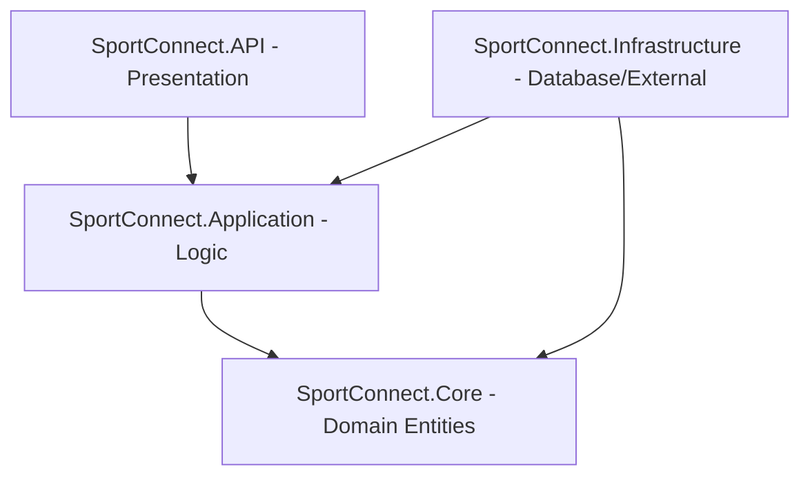
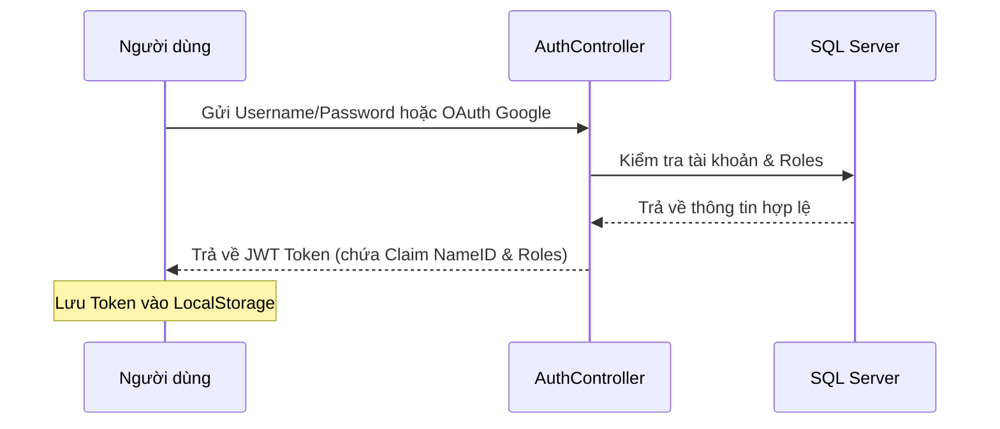
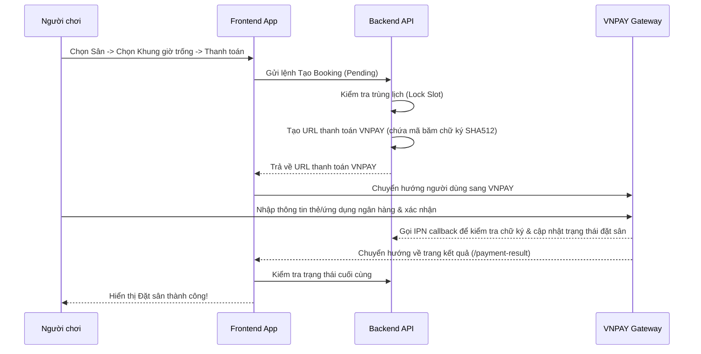
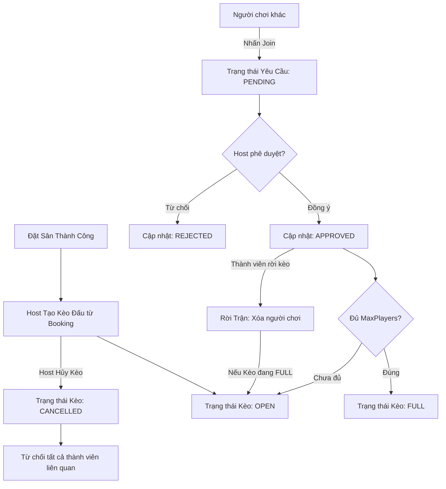

# SportConnect - Tài Liệu Hướng Dẫn Kỹ Thuật & Bàn Giao (Developer Onboarding Guide)

Chào mừng bạn đến với dự án **SportConnect**! Tài liệu này tổng hợp toàn bộ thông tin kiến trúc, tính năng, luồng hoạt động chính và hướng dẫn phát triển chi tiết nhằm giúp bạn nhanh chóng làm quen và có thể trực tiếp tham gia phát triển hệ thống.

---

## 1. Tổng Quan Hệ Thống

**SportConnect** là một nền tảng Web App PWA (Progressive Web App) kết nối trực tiếp **Chủ sân thể thao (Venue Owner)** và **Người chơi thể thao (Players)**.
* **Người chơi**: Tìm kiếm sân bãi theo vị trí địa lý, xem lịch trống, đặt lịch chơi, thanh toán online (VNPAY), và tạo/tham gia các kèo đấu ghép đội (Matchmaking).
* **Chủ sân**: Đăng ký cơ sở, cấu hình khung giờ hoạt động, biểu giá, quản lý lịch đặt sân và xem thống kê doanh thu.
* **Admin hệ thống**: Phê duyệt hồ sơ nâng cấp chủ sân, quản lý danh mục thể thao, giám sát người dùng và các cơ sở sân bãi.

### Công Nghệ Sử Dụng (Tech Stack)
* **Backend**: .NET Core 9, Entity Framework Core, SQL Server.
* **Frontend**: ReactJS, TypeScript, Vite, React Query (TanStack), Axios, Lucide Icons, Framer Motion (hiệu ứng chuyển trang).
* **Payment Gateway**: VNPAY Integration.
* **Map Services**: Google Maps JS SDK (Places API, Autocomplete, Marker).

---

## 2. Kiến Trúc Hệ Thống (System Architecture)

### 2.1. Phía Backend (Clean Architecture)
Mã nguồn Backend được tổ chức thành 4 phân lớp rõ rệt để đảm bảo tính độc lập và dễ kiểm thử:



1. **SportConnect.Core (Domain Layer)**: 
   * Chứa các thực thể cơ sở dữ liệu (`User`, `Role`, `Venue`, `Court`, `Booking`, `Match`, `MatchPlayer`, `Notification`, v.v.).
   * Không phụ thuộc vào bất kỳ thư viện hay framework bên ngoài nào.
2. **SportConnect.Application (Application Layer)**:
   * Chứa các Interface dịch vụ (`IAdminService`, `IMatchService`, `IBookingService`), các DTOs truyền nhận dữ liệu, và logic nghiệp vụ chính của hệ thống.
3. **SportConnect.Infrastructure (Infrastructure Layer)**:
   * Hiện thực hóa kết nối Database (`MyDbContext`), triển khai cấu hình Entity Framework Fluent API.
   * Triển khai mẫu thiết kế **Generic Repository** và **Unit of Work** để quản lý giao dịch (transactions).
   * Triển khai các dịch vụ ngoài (VNPAY Library, Email Service).
4. **SportConnect.API (Presentation Layer)**:
   * Chứa các API Controllers (`AuthController`, `BookingController`, `MatchController`, `AdminController`).
   * Xử lý xác thực JWT (Token Validation) và phân quyền phân cấp bằng ASP.NET Core Identity/Roles.

### 2.2. Phía Frontend (React PWA)
Mã nguồn Frontend tổ chức trong thư mục `/Frontend/src` theo mô hình Component-Driven kết hợp React Query để quản lý state bất đồng bộ:

* **`/api`**: Cấu hình `axiosClient` tự động đính kèm JWT token từ localStorage vào header và xử lý lỗi tập trung.
* **`/components`**: Các component tái sử dụng (Layout, Form xác thực, Notification toàn cục).
* **`/hooks`**: 
  * `/queries`: Các query hook tải dữ liệu (sử dụng React Query) giúp tự động lưu bộ nhớ đệm (caching) và tự động làm mới.
  * `/mutations`: Các mutation hook gửi yêu cầu thay đổi dữ liệu (tạo sân, đặt lịch, duyệt yêu cầu).
* **`/pages`**: Các trang giao diện chính chia theo nhóm chức năng: `auth/`, `home/`, `owner/`, `admin/`, `profile/`.
* **`/services`**: Định nghĩa các hàm gọi API trực tiếp qua Axios.

---

## 3. Các Luồng Nghiệp Vụ Cốt Lõi (Core Workflows)

### 3.1. Luồng Xác Thực & Phân Quyền (Authentication & RBAC)
Hệ thống sử dụng cơ chế JWT Token để xác thực người dùng. Quyền hạn được chia làm 3 nhóm chính: `Default` (Người chơi), `Owner` (Chủ sân) và `Admin` (Quản trị viên).



* **Frontend Route Guards**:
  * [AuthGuard.tsx](file:///d:/IT/HK2_Y4/DATN/Frontend/src/pages/auth/AuthGuard.tsx): Bảo vệ các trang cá nhân của người chơi (Settings, Profile).
  * [OwnerGuard.tsx](file:///d:/IT/HK2_Y4/DATN/Frontend/src/pages/owner/OwnerGuard.tsx): Chỉ cho phép người dùng có Role `Owner` vào trang quản lý sân bãi và lịch đặt.
  * [AdminGuard.tsx](file:///d:/IT/HK2_Y4/DATN/pages/admin/AdminGuard.tsx): Chỉ bảo vệ các tuyến đường `/admin/*` dành riêng cho quản trị viên tối cao.

---

### 3.2. Luồng Đặt Sân & Thanh Toán VNPAY (Booking & Payment Gateway)
Đây là luồng nghiệp vụ phức tạp nhất, đảm bảo tính nhất quán dữ liệu tránh trường hợp hai người đặt trùng một khung giờ chơi (Double Booking).



> [!IMPORTANT]
> **Xử lý chữ ký bảo mật VNPAY**: Backend thực hiện thuật toán băm HMAC-SHA512 với `HashSecret` để tạo mã bảo mật. Khi nhận dữ liệu phản hồi từ VNPAY, Backend phải sắp xếp tham số theo bảng chữ cái và tạo lại mã băm để so khớp trước khi cập nhật cơ sở dữ liệu nhằm phòng chống giả mạo giao dịch.

---

### 3.3. Luồng Tìm Đối & Ghép Đội (Matchmaking Flow)
Cho phép người chơi sau khi đặt sân thành công có thể chia sẻ sân lên bảng tin chung để rủ thêm người chơi ghép đội, chia sẻ chi phí sân.

* **Trạng thái Kèo đấu (Match Status)**:
  * `OPEN`: Kèo đấu đang tuyển thêm người chơi.
  * `FULL`: Trận đấu đã đủ số lượng thành viên tối đa đặt ra.
  * `COMPLETED`: Trận đấu đã diễn ra thành công.
  * `CANCELLED`: Kèo đấu đã bị Host hủy bỏ.



* **Các API mới triển khai liên quan**:
  * `RejectJoin` (`PUT /api/matches/{id}/reject/{userId}`): Cho phép Host từ chối thành viên gửi yêu cầu.
  * `LeaveMatch` (`POST /api/matches/{id}/leave`): Cho phép thành viên tự rời kèo đấu, tự động mở lại trạng thái `OPEN` cho kèo đấu nếu trước đó kèo bị chuyển sang `FULL`.
  * `CancelMatch` (`DELETE /api/matches/{id}`): Cho phép Host hủy toàn bộ kèo đấu bất kỳ lúc nào trước giờ đấu.

---

### 3.4. Luồng Đăng Ký Chủ Sân & Định Vị Bản Đồ
Luồng giúp chuyển dịch người dùng từ người chơi (`Default`) lên vai trò chủ doanh nghiệp (`Owner`).

1. **Khối Hành Chính Địa Phương Offline**:
   * Hệ thống tích hợp bộ dữ liệu tỉnh thành Việt Nam thông qua file JSON cục bộ (`vietnam_units.json`) phẳng hóa cấp 2 để phục vụ việc tìm kiếm phân loại sân theo Quận/Huyện/Thành phố thuộc tỉnh (Xử lý mượt mà các trường hợp thành lập Thành phố thuộc Thành phố như TP. Thủ Đức).
2. **Định Vị Google Maps Chính Xác Tuyệt Đối**:
   * **Google Places Autocomplete**: Người dùng nhập tên/địa chỉ sân, Google Maps gợi ý tự động địa điểm thực tế trên bản đồ. Khi được chọn, trả về vĩ độ (`latitude`) và kinh độ (`longitude`) chính xác.
   * **Draggable Map Marker**: Hiển thị bản đồ nhỏ, cho phép chủ sân di chuyển ghim (Marker) để chỉ định chính xác lối vào sân bóng của mình trên Google Maps, giúp người chơi định vị chính xác khi di chuyển.

---

## 4. Hướng Dẫn Dành Cho Nhà Phát Triển Mới (Intern)

### 4.1. Cách Chạy Dự Án Dưới Local

#### Yêu cầu môi trường (Prerequisites):
* .NET SDK 9.0
* SQL Server LocalDB hoặc Docker SQL Server Express
* Node.js v18 trở lên

#### Khởi chạy Backend (.NET Core 9):
1. Mở terminal tại thư mục `/Backend`.
2. Kiểm tra chuỗi kết nối trong `appsettings.json` tại dự án `SportConnect.API`.
3. Chạy lệnh:
   ```bash
   dotnet restore
   dotnet build
   dotnet run --project SportConnect.API
   ```
4. Truy cập Swagger UI tại: `http://localhost:5254/swagger/index.html` để kiểm tra các API hoạt động.

#### Khởi chạy Frontend (ReactJS):
1. Mở terminal tại thư mục `/Frontend`.
2. Chạy lệnh cài đặt thư viện:
   ```bash
   npm install
   ```
3. Khởi chạy dev server:
   ```bash
   npm run dev
   ```
4. Mở trình duyệt truy cập `http://localhost:5173`.

---

### 4.2. Các Mẫu Thiết Kế Thường Gặp & Cách Bổ Sung Tính Năng Mới

#### Mẫu 1: Cách Thêm Một API Mới Ở Backend
1. **Core**: Định nghĩa thực thể Entity mới (nếu cần) và đăng ký DbSet trong `MyDbContext.cs`.
2. **Application**:
   * Định nghĩa DTOs trong thư mục `DTOs/`.
   * Định nghĩa interface nghiệp vụ trong `Interfaces/` (ví dụ: `IReviewService.cs`).
   * Hiện thực hóa logic nghiệp vụ tại lớp Service tương ứng trong `Services/`.
3. **API**: 
   * Tạo Controller mới thừa kế `ControllerBase`.
   * Đăng ký các Endpoint với các attribute định tuyến (`[HttpGet]`, `[HttpPost]`, `[Authorize]`).
4. **Dependency Injection**: Khai báo đăng ký dịch vụ trong `Program.cs` (Ví dụ: `builder.Services.AddScoped<IReviewService, ReviewService>();`).

#### Mẫu 2: Cách Gọi API Và Cập Nhật UI Ở Frontend (React Query)
1. Thêm hàm gọi API trong file service tương ứng tại `/Frontend/src/services` (ví dụ: `matchService.ts`).
2. Khai báo Hook React Query:
   * Nếu là tải dữ liệu: Viết hook `useQuery` trong `/queries`.
   * Nếu là chỉnh sửa dữ liệu: Viết hook `useMutation` trong `/mutations`. Đừng quên gọi `queryClient.invalidateQueries` tại `onSuccess` để tự động cập nhật dữ liệu mới lên UI.
3. Import hook vào Component và sử dụng state `isLoading`, `data` hoặc hàm kích hoạt `mutateAsync` để xây dựng giao diện.
