# Sơ Đồ Luồng Giao Diện (UI Flow Diagram) - SportConnect

Dưới đây là sơ đồ luồng các màn hình trong hệ thống SportConnect, được mô tả tương tự như Flow trong Figma, bao gồm luồng Khách hàng (User), Chủ sân (Owner) và Quản trị viên (Admin).

```mermaid
graph TD
    %% Định dạng phong cách các node
    classDef tab fill:#e2f0e6,stroke:#326441,stroke-width:2px,color:#204e2e;
    classDef auth fill:#fef3c7,stroke:#d97706,stroke-width:2px;
    classDef detail fill:#e0f2fe,stroke:#0284c7,stroke-width:2px;
    classDef owner fill:#f3e8ff,stroke:#9333ea,stroke-width:2px;
    classDef admin fill:#ffe4e6,stroke:#e11d48,stroke-width:2px;
    classDef profile fill:#fdf4ff,stroke:#c026d3,stroke-width:2px;

    %% === MAIN BOTTOM NAVIGATION TABS ===
    subgraph BottomNav ["Menu Điều Hướng Dưới (Bottom Navigation)"]
        direction LR
        Home["Trang Chủ ( / )"]:::tab
        MapPage["Bản Đồ ( /map )"]:::tab
        Explore["Khám Phá ( /explore )"]:::tab
        Matches["Kèo Đấu ( /matches )"]:::tab
        Account["Tài Khoản ( /account )"]:::tab
        Me["Cá Nhân ( /me )"]:::tab
    end

    %% === AUTHENTICATION FLOW ===
    subgraph AuthFlow ["Luồng Xác Thực"]
        Account -- "Chưa đăng nhập" --> Login["Đăng Nhập ( /login )"]:::auth
        Login -- "Chưa có tài khoản" --> Register["Đăng Ký ( /register )"]:::auth
        Login -- "Quên mật khẩu" --> ForgotPwd["Quên Mật Khẩu ( /forgot-password )"]:::auth
        Register --> Login
        ForgotPwd --> Login
        Login -- "Đăng nhập thành công" --> Home
    end

    %% === BOOKING & VENUE DETAIL FLOW ===
    subgraph BookingFlow ["Luồng Tìm Kiếm & Đặt Sân"]
        Home --> VenueDetail["Chi Tiết Sân ( /venue/:id )"]:::detail
        MapPage -- "Chọn sân trên bản đồ" --> VenueDetail
        VenueDetail -- "Đặt lịch & Thanh toán" --> PaymentResult["Kết Quả Thanh Toán ( /payment-result )"]:::detail
        PaymentResult -- "Hoàn tất" --> Home
    end

    %% === MAP & EXPLORE FLOW ===
    subgraph MapExploreFlow ["Luồng Bản Đồ & Khám Phá"]
        MapPage -- "Tìm sân gần đây" --> MapSearch["Tìm kiếm & Lọc theo môn"]:::detail
        MapSearch -- "Chọn marker sân" --> VenueDetail
        Explore -- "Đọc bảng tin" --> ExploreFeed["Bảng Tin Xã Hội"]:::detail
        Explore -- "Giải đấu" --> ExploreTournaments["Danh Sách Giải Đấu"]:::detail
        Explore -- "Lớp học" --> ExploreClasses["Lớp Huấn Luyện"]:::detail
        Explore -- "Ưu đãi" --> ExplorePromos["Khuyến Mãi & Coupon"]:::detail
    end

    %% === MATCHMAKING FLOW ===
    subgraph MatchFlow ["Luồng Tìm Kèo"]
        Matches --> MatchDetail["Chi Tiết Kèo Đấu ( /matches/:id )"]:::detail
        MatchDetail -- "Tham gia / Rời kèo" --> Matches
    end

    %% === USER PROFILE FLOW ===
    subgraph ProfileFlow ["Luồng Quản Lý Cá Nhân"]
        Me -- "Cập nhật Avatar/Tên" --> ProfileEdit["Hồ Sơ ( /profile )"]:::profile
        Me -- "Xem lịch sử" --> MyBookings["Lịch Sử Đặt Sân ( /me/bookings )"]:::profile
        Me -- "Cài đặt & Bảo mật" --> Settings["Cài Đặt ( /settings )"]:::profile
        Settings --> ChangePwd["Đổi Mật Khẩu ( /settings/change-password )"]:::profile
        
        Me -- "Muốn trở thành Chủ sân" --> OwnerOnboarding["Đăng Ký Chủ Sân ( /owner/onboarding )"]:::profile
        OwnerOnboarding -- "Chờ Admin duyệt" --> Me
    end

    %% === OWNER PORTAL FLOW ===
    subgraph OwnerFlow ["Luồng Dành Cho Chủ Sân"]
        OwnerOnboarding -- "Được duyệt" --> OwnerDash["Owner Dashboard ( /owner )"]:::owner
        Me -- "Chuyển chế độ Chủ sân" --> OwnerDash
        
        OwnerDash --> OwnerBookings["Quản Lý Lịch Đặt ( /owner/bookings )"]:::owner
        OwnerDash --> OwnerVenues["Quản Lý Cụm Sân ( /owner/venues )"]:::owner
        OwnerVenues --> VenueConfig["Cấu Hình Sân Nhỏ ( /owner/venues/:id )"]:::owner
    end

    %% === ADMIN PORTAL FLOW ===
    subgraph AdminFlow ["Luồng Dành Cho Quản Trị Viên"]
        AdminLogin["Admin Login ( /admin/login )"]:::admin
        AdminLogin -- "Thành công" --> AdminDash["Admin Dashboard ( /admin )"]:::admin
        
        AdminDash --> AdminUsers["Quản Lý Users ( /admin/users )"]:::admin
        AdminDash --> AdminRequests["Duyệt Yêu Cầu Chủ Sân ( /admin/owner-requests )"]:::admin
        AdminDash --> AdminCategories["Quản Lý Môn Thể Thao ( /admin/sport-categories )"]:::admin
    end
```

## Chú giải màn hình (Legend):
- **Màu Xanh Lá (Khung viền):** Các tab điều hướng chính (luôn hiển thị thanh menu bên dưới). Bao gồm: Trang chủ, Bản đồ, Khám phá, Kèo đấu, Tài khoản.
- **Màu Vàng:** Màn hình xác thực (Đăng nhập, Đăng ký).
- **Màu Xanh Dương:** Luồng tương tác chính của khách hàng (Xem chi tiết sân, bản đồ tìm sân, bảng tin khám phá, thanh toán).
- **Màu Tím Nhạt:** Quản lý cá nhân của người dùng đã đăng nhập.
- **Màu Tím Đậm:** Cổng quản lý dành riêng cho Chủ Sân.
- **Màu Đỏ Hồng:** Cổng quản trị dành riêng cho Admin hệ thống.

## Ghi chú kỹ thuật:
- **Bản đồ (`/map`):** Sử dụng Google Maps JavaScript API, hỗ trợ GPS định vị, lọc theo môn thể thao (dữ liệu từ DB), bán kính tìm kiếm 1-10km.
- **Khám phá (`/explore`):** Bảng tin xã hội dạng Facebook/Zalo với 4 tab: Bảng tin, Giải đấu, Lớp học, Ưu đãi.
