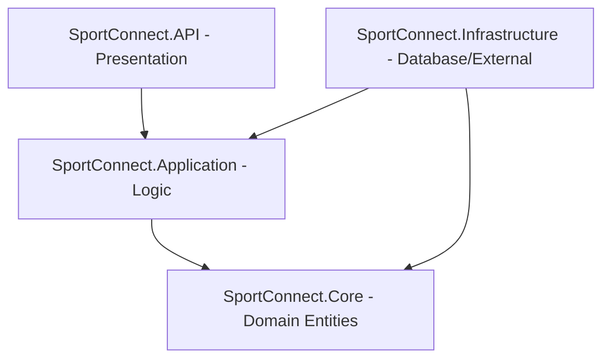
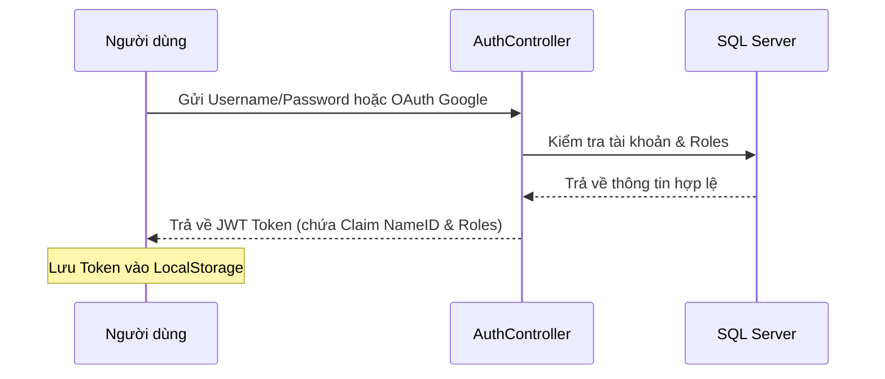
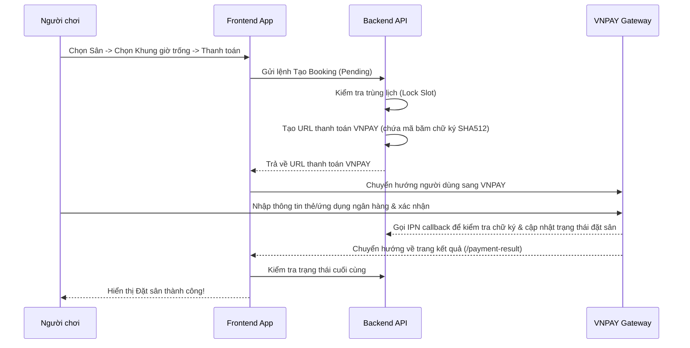
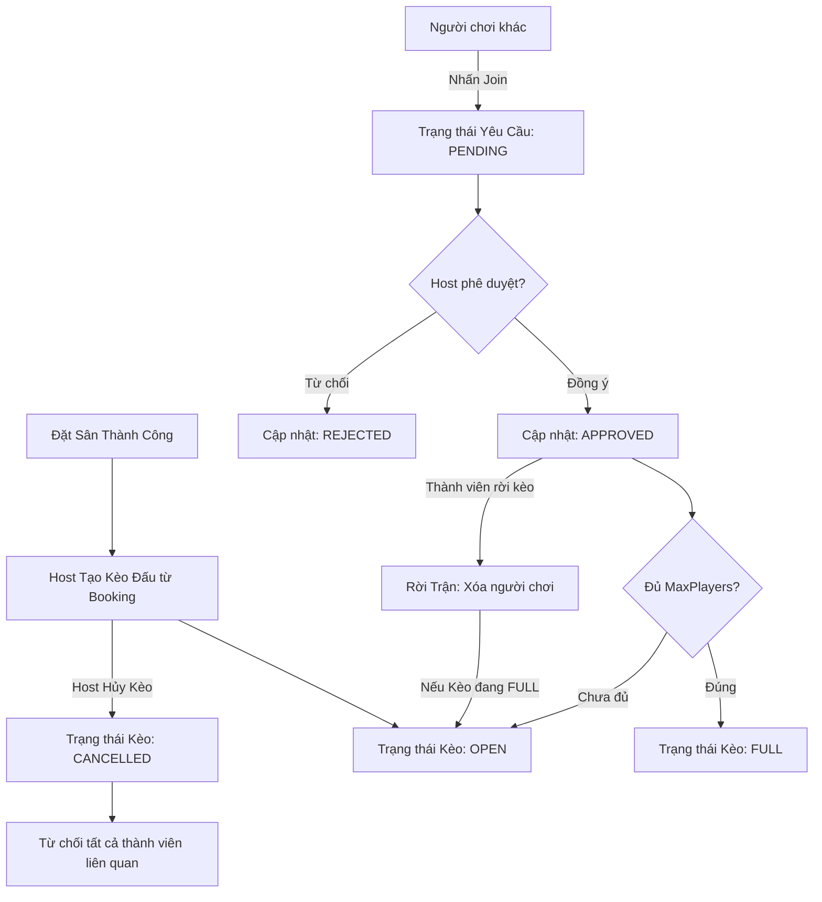

# SportConnect - Tài Liệu Hướng Dẫn Kỹ Thuật & Bàn Giao (Developer Onboarding Guide)

Chào mừng bạn đến với dự án **SportConnect**! Tài liệu này tổng hợp toàn bộ thông tin kiến trúc, tính năng, luồng hoạt động chính và hướng dẫn phát triển chi tiết nhằm giúp bạn nhanh chóng làm quen và có thể trực tiếp tham gia phát triển hệ thống.

---

## 1. Tổng Quan Hệ Thống

**SportConnect** là một nền tảng Web App PWA (Progressive Web App) kết nối trực tiếp **Chủ sân thể thao (Venue Owner)** và **Người chơi thể thao (Players)**.
* **Người chơi**: Tìm kiếm sân bãi theo vị trí địa lý, xem lịch trống, đặt lịch chơi, thanh toán online (VNPAY), và tạo/tham gia các kèo đấu ghép đội (Matchmaking).
* **Chủ sân**: Đăng ký cơ sở, cấu hình khung giờ hoạt động, biểu giá, quản lý lịch đặt sân và xem thống kê doanh thu.
* **Admin hệ thống**: Phê duyệt hồ sơ nâng cấp chủ sân, quản lý danh mục thể thao, giám sát người dùng và các cơ sở sân bãi.

### Công Nghệ Sử Dụng (Tech Stack)
* **Backend**: .NET Core 9, Entity Framework Core, SQL Server.
* **Frontend**: ReactJS, TypeScript, Vite, React Query (TanStack), Axios, Lucide Icons, Framer Motion (hiệu ứng chuyển trang).
* **Payment Gateway**: VNPAY Integration.
* **Map Services**: Google Maps JS SDK (Places API, Autocomplete, Marker).

---

## 2. Kiến Trúc Hệ Thống (System Architecture)

### 2.1. Phía Backend (Clean Architecture)
Mã nguồn Backend được tổ chức thành 4 phân lớp rõ rệt để đảm bảo tính độc lập và dễ kiểm thử:



1. **SportConnect.Core (Domain Layer)**: 
   * Chứa các thực thể cơ sở dữ liệu (`User`, `Role`, `Venue`, `Court`, `Booking`, `Match`, `MatchPlayer`, `Notification`, v.v.).
   * Không phụ thuộc vào bất kỳ thư viện hay framework bên ngoài nào.
2. **SportConnect.Application (Application Layer)**:
   * Chứa các Interface dịch vụ (`IAdminService`, `IMatchService`, `IBookingService`), các DTOs truyền nhận dữ liệu, và logic nghiệp vụ chính của hệ thống.
3. **SportConnect.Infrastructure (Infrastructure Layer)**:
   * Hiện thực hóa kết nối Database (`MyDbContext`), triển khai cấu hình Entity Framework Fluent API.
   * Triển khai mẫu thiết kế **Generic Repository** và **Unit of Work** để quản lý giao dịch (transactions).
   * Triển khai các dịch vụ ngoài (VNPAY Library, Email Service).
4. **SportConnect.API (Presentation Layer)**:
   * Chứa các API Controllers (`AuthController`, `BookingController`, `MatchController`, `AdminController`).
   * Xử lý xác thực JWT (Token Validation) và phân quyền phân cấp bằng ASP.NET Core Identity/Roles.

### 2.2. Phía Frontend (Phân tách hai Phân hệ)

Mã nguồn Frontend được chia thành 2 phân hệ độc lập:
1. **User PWA (`Frontend/user`)**: React 19, TypeScript, Vite. Chứa luồng người chơi và chủ sân, tối ưu PWA trên di động.
2. **Admin Portal (`Frontend/admin`)**: Next.js 15, TypeScript, Tailwind CSS, Shadcn UI. Chứa bảng điều khiển của quản trị viên hệ thống.

---

## 2.3. Bản Đồ Chi Tiết Mã Nguồn & Nhiệm Vụ Từng File (Codebase & File Mapping)

Để hỗ trợ quá trình phát triển nhanh chóng, dưới đây là bảng mô tả chi tiết nhiệm vụ và nội dung mã nguồn của các tệp tin quan trọng trong dự án.

### 2.3.1. Phía Backend (.NET Core 9)

#### A. Dự án SportConnect.Core (Lớp Thực Thể - Domain Layer)
Chứa định nghĩa cấu trúc dữ liệu và các thực thể của hệ thống, ánh xạ trực tiếp xuống cơ sở dữ liệu SQL Server thông qua Entity Framework Core.

* **Thư mục `Entities/`**:
  * [User.cs](file:///d:/IT/HK2_Y4/DATN/Backend/SportConnect.Core/Entities/User.cs): Định nghĩa thực thể Người dùng (User). Mở rộng thông tin từ ASP.NET Core Identity (Username, Email, Phone, PasswordHash, ngày tạo `CreatedAt`). Quản lý trạng thái khóa tài khoản và liên kết với các bảng Bookings, Matches.
  * [Role.cs](file:///d:/IT/HK2_Y4/DATN/Backend/SportConnect.Core/Entities/Role.cs): Định nghĩa các vai trò phân quyền trong hệ thống bao gồm `Default` (Người chơi), `Owner` (Chủ sân) và `Admin` (Quản trị viên).
  * [User_Role.cs](file:///d:/IT/HK2_Y4/DATN/Backend/SportConnect.Core/Entities/User_Role.cs): Thực thể liên kết nhiều-nhiều (Many-to-Many Join Table) giữa Người dùng và Vai trò.
  * [OwnerProfile.cs](file:///d:/IT/HK2_Y4/DATN/Backend/SportConnect.Core/Entities/OwnerProfile.cs): Chứa hồ sơ thông tin đăng ký làm chủ sân (Số CCCD, Mã số thuế/Giấy phép kinh doanh, Trạng thái phê duyệt `Pending/Approved/Rejected`, Lý do từ chối nếu có).
  * [Venue.cs](file:///d:/IT/HK2_Y4/DATN/Backend/SportConnect.Core/Entities/Venue.cs): Thực thể Cơ sở thể thao (Sân lớn). Chứa Tên sân, Địa chỉ chi tiết, Tỉnh/Thành phố, Kinh độ (`Longitude`), Vĩ độ (`Latitude`), Mô tả sân, Giờ mở/đóng cửa và Khóa ngoại liên kết tới chủ sân (`OwnerId`).
  * [Court.cs](file:///d:/IT/HK2_Y4/DATN/Backend/SportConnect.Core/Entities/Court.cs): Thực thể Sân đấu con (ví dụ: Sân bóng 5 người số 1, Sân Badminton số 2) nằm trong một Cơ sở thể thao (`VenueId`).
  * [Price.cs](file:///d:/IT/HK2_Y4/DATN/Backend/SportConnect.Core/Entities/Price.cs): Định nghĩa bảng giá dịch vụ sân. Quản lý mức giá khác nhau dựa trên khung giờ (Giờ cao điểm/Thường) và ngày trong tuần.
  * [Booking.cs](file:///d:/IT/HK2_Y4/DATN/Backend/SportConnect.Core/Entities/Booking.cs): Quản lý thông tin đặt lịch. Ghi nhận `CourtId` đặt, `UserId` đặt, Ngày chơi, Giờ bắt đầu/Kết thúc, Tổng tiền, Trạng thái đặt (`Pending, Paid, Cancelled, Completed`), mã giao dịch ngân hàng và thông tin VNPAY.
  * [Match.cs](file:///d:/IT/HK2_Y4/DATN/Backend/SportConnect.Core/Entities/Match.cs): Thực thể Kèo đấu ghép đội. Gắn liền với một lịch đặt sân (`BookingId`), ghi nhận thông tin môn thể thao, trình độ yêu cầu (Yếu/Trung bình/Khá), số lượng người chơi cần tuyển (`MaxPlayers`), số người đã tham gia, trạng thái (`OPEN, FULL, CANCELLED`).
  * [MatchPlayer.cs](file:///d:/IT/HK2_Y4/DATN/Backend/SportConnect.Core/Entities/MatchPlayer.cs): Thực thể liên kết giữa Người chơi và Kèo đấu, lưu trạng thái yêu cầu gia nhập (`Pending` chờ duyệt, `Approved` đã tham gia, `Rejected` bị từ chối).
  * [Review.cs](file:///d:/IT/HK2_Y4/DATN/Backend/SportConnect.Core/Entities/Review.cs): Lưu trữ điểm đánh giá (Rating từ 1-5 sao) và bình luận phản hồi của người chơi đối với cơ sở sân bãi.
  * [SportCategory.cs](file:///d:/IT/HK2_Y4/DATN/Backend/SportConnect.Core/Entities/SportCategory.cs): Danh mục các môn thể thao hệ thống hỗ trợ (Bóng đá, Cầu lông, Tennis, Bóng rổ).
  * [Notification.cs](file:///d:/IT/HK2_Y4/DATN/Backend/SportConnect.Core/Entities/Notification.cs): Thực thể lưu trữ tin nhắn thông báo đẩy cho người dùng (Thông báo đặt sân thành công, có người xin gia nhập kèo đấu, v.v.).
  * [FavoriteVenue.cs](file:///d:/IT/HK2_Y4/DATN/Backend/SportConnect.Core/Entities/FavoriteVenue.cs): Lưu danh sách các cơ sở sân bóng yêu thích của từng người chơi.
  * [Staff.cs](file:///d:/IT/HK2_Y4/DATN/Backend/SportConnect.Core/Entities/Staff.cs) & [Staff_Code.cs](file:///d:/IT/HK2_Y4/DATN/Backend/SportConnect.Core/Entities/Staff_Code.cs): Quản lý thông tin nhân viên hỗ trợ sân và mã xác thực phân quyền quản lý nội bộ.

#### B. Dự án SportConnect.Application (Lớp Nghiệp Vụ - Application Layer)
Đóng vai trò trung gian xử lý logic nghiệp vụ, khai báo các giao thức (Interfaces) và cấu trúc truyền nhận dữ liệu (DTOs).

* **Thư mục `Interfaces/`**: Khai báo các giao diện dịch vụ (ví dụ: `IAuthService`, `IBookingService`, `IMatchService`, `IAdminService`). Giúp đảm bảo tính lỏng lẻo (loose coupling) phục vụ viết Unit Test.
* **Thư mục `DTOs/`**: Các class chứa dữ liệu đầu vào/đầu ra cho API, loại bỏ các trường không cần thiết hoặc nhạy cảm của Entity gốc trước khi gửi đi.
* **Thư mục `Services/` (Thực thi logic nghiệp vụ)**:
  * [AuthService.cs](file:///d:/IT/HK2_Y4/DATN/Backend/SportConnect.Application/Services/AuthService.cs): Xử lý đăng ký, đăng nhập tài khoản thường và Google OAuth. Thực hiện mã hóa mật khẩu, kiểm tra quyền hạn và phát hành JWT Token (hạn dùng, claims).
  * [BookingService.cs](file:///d:/IT/HK2_Y4/DATN/Backend/SportConnect.Application/Services/BookingService.cs): Kiểm tra xung đột lịch đặt sân (Double Booking) bằng thuật toán so khớp khoảng thời gian. Tính toán tổng tiền dựa trên cấu hình giá giờ cao điểm. Cập nhật trạng thái đặt sân sau khi nhận kết quả thanh toán từ VNPAY.
  * [MatchService.cs](file:///d:/IT/HK2_Y4/DATN/Backend/SportConnect.Application/Services/MatchService.cs): Logic tạo kèo ghép đội từ lịch đặt sân đã thanh toán. Kiểm tra số lượng người, logic xin tham gia, phê duyệt/từ chối thành viên của Host, xử lý tự động chuyển trạng thái `OPEN` <-> `FULL` khi thành viên tham gia hoặc rời kèo.
  * [OwnerOnboardingService.cs](file:///d:/IT/HK2_Y4/DATN/Backend/SportConnect.Application/Services/OwnerOnboardingService.cs): Xử lý hồ sơ xin nâng cấp tài khoản lên Chủ sân, kiểm tra tính hợp lệ của giấy tờ kinh doanh trước khi gửi lên cho Admin duyệt.
  * [OwnerVenueService.cs](file:///d:/IT/HK2_Y4/DATN/Backend/SportConnect.Application/Services/OwnerVenueService.cs): Cung cấp các chức năng cho chủ sân: Tạo mới cơ sở sân, cấu hình sơ đồ sân con, định nghĩa biểu giá, xem danh sách lịch đặt sân tại cơ sở và truy vấn dữ liệu báo cáo thống kê doanh thu theo thời gian.
  * [PublicVenueService.cs](file:///d:/IT/HK2_Y4/DATN/Backend/SportConnect.Application/Services/PublicVenueService.cs): Hỗ trợ người dùng tìm kiếm sân công khai, lọc sân theo bộ lọc tỉnh thành, quận huyện, khoảng cách địa lý (tính bằng công thức toán học bán kính GPS) và môn thể thao.
  * [ReviewService.cs](file:///d:/IT/HK2_Y4/DATN/Backend/SportConnect.Application/Services/ReviewService.cs): Tiếp nhận đánh giá phản hồi từ người chơi, tính toán lại điểm đánh giá trung bình (Average Rating) của cơ sở sân bóng.
  * [AdminService.cs](file:///d:/IT/HK2_Y4/DATN/Backend/SportConnect.Application/Services/AdminService.cs): Các nghiệp vụ đặc quyền của quản trị viên: Phê duyệt hồ sơ đăng ký chủ sân, khóa/mở khóa tài khoản người dùng vi phạm, quản trị danh mục các môn thể thao.

#### C. Dự án SportConnect.Infrastructure (Lớp Hạ Tầng - Infrastructure Layer)
Tương tác trực tiếp với cơ sở dữ liệu và các API/dịch vụ của bên thứ ba.

* **Thư mục `Persistence/Context/MyDbContext.cs`**:
  * Cấu hình kết nối SQL Server, khai báo các bảng dữ liệu `DbSet<T>`.
  * Cấu hình ràng buộc dữ liệu Fluent API (khóa ngoại, chỉ mục index, hành vi xóa Cascade Delete).
* **Thư mục `Persistence/Repositories/`**:
  * [GenericRepository.cs](file:///d:/IT/HK2_Y4/DATN/Backend/SportConnect.Infrastructure/Persistence/Repositories/GenericRepository.cs): Lớp dùng chung triển khai các truy vấn SQL cơ bản (Thêm, Xóa, Sửa, Lấy theo ID, Lấy danh sách kèm phân trang) cho tất cả thực thể mà không cần viết lại mã SQL/EF Core.
  * [UnitOfWork.cs](file:///d:/IT/HK2_Y4/DATN/Backend/SportConnect.Infrastructure/Persistence/Repositories/UnitOfWork.cs): Đảm bảo tính toàn vẹn dữ liệu (Transaction) khi thực hiện nhiều lệnh ghi cơ sở dữ liệu đồng thời. Nếu một lệnh lỗi, toàn bộ giao dịch sẽ được Rollback lại.
  * [AdminRepository.cs](file:///d:/IT/HK2_Y4/DATN/Backend/SportConnect.Infrastructure/Persistence/Repositories/AdminRepository.cs): Triển khai các câu truy vấn phức tạp phục vụ thống kê tổng thể của Admin hệ thống.
* **Thư mục `Services/`**:
  * [VnPayLibrary.cs](file:///d:/IT/HK2_Y4/DATN/Backend/SportConnect.Infrastructure/Services/VnPayLibrary.cs): Thư viện mã hóa hỗ trợ sắp xếp các tham số thanh toán theo thứ tự Alphabet và thực hiện băm bảo mật HMAC-SHA512 để tạo chữ ký giao dịch.
  * [VnPayService.cs](file:///d:/IT/HK2_Y4/DATN/Backend/SportConnect.Infrastructure/Services/VnPayService.cs): Xây dựng URL thanh toán để điều hướng người dùng sang cổng giao dịch VNPAY và kiểm tra tính hợp lệ của chữ ký phản hồi.
  * [NotificationService.cs](file:///d:/IT/HK2_Y4/DATN/Backend/SportConnect.Infrastructure/Services/NotificationService.cs): Xử lý lưu trữ thông báo vào database và định tuyến gửi thông báo thời gian thực.

#### D. Dự án SportConnect.API (Lớp Giao Tiếp - Presentation Layer)
Nơi tiếp nhận các yêu cầu HTTP Request từ Frontend, kiểm tra quyền truy cập và chuyển tiếp xử lý.

* **Thư mục `Controllers/`**:
  * [AuthController.cs](file:///d:/IT/HK2_Y4/DATN/Backend/SportConnect.API/Controllers/AuthController.cs): API Đăng nhập, đăng ký, đăng nhập bằng Google, làm mới token.
  * [BookingController.cs](file:///d:/IT/HK2_Y4/DATN/Backend/SportConnect.API/Controllers/BookingController.cs): API tạo yêu cầu đặt sân, kiểm tra khung giờ trống, xem lịch sử đặt sân của cá nhân.
  * [PaymentController.cs](file:///d:/IT/HK2_Y4/DATN/Backend/SportConnect.API/Controllers/PaymentController.cs): API tiếp nhận phản hồi từ cổng thanh toán VNPAY (IPN Endpoint), đảm bảo giao dịch được cập nhật chính xác dù người dùng có tắt trình duyệt.
  * [MatchController.cs](file:///d:/IT/HK2_Y4/DATN/Backend/SportConnect.API/Controllers/MatchController.cs): API tạo kèo ghép, yêu cầu gia nhập, phê duyệt thành viên, hủy kèo và rời kèo đấu.
  * [OwnerVenueController.cs](file:///d:/IT/HK2_Y4/DATN/Backend/SportConnect.API/Controllers/OwnerVenueController.cs): API cấu hình sân con, lịch hoạt động và biểu đồ báo cáo doanh thu của chủ sân.
  * [AdminController.cs](file:///d:/IT/HK2_Y4/DATN/Backend/SportConnect.API/Controllers/AdminController.cs): API quản trị người dùng, duyệt hồ sơ nâng cấp chủ sân và quản lý danh mục hệ thống.

---

### 2.3.2. Phía Frontend

#### A. Phân hệ User PWA (`Frontend/user`)
Mã nguồn ứng dụng di động nằm trong thư mục `/Frontend/user/src`:
* [main.tsx](file:///d:/IT/HK2_Y4/DATN/Frontend/user/src/main.tsx): Điểm khởi chạy React, cấu hình QueryClient và Google OAuth Provider.
* [App.tsx](file:///d:/IT/HK2_Y4/DATN/Frontend/user/src/App.tsx): Bộ định tuyến chính của PWA. Có wildcard route `path="*"` dẫn tới `NotFoundPage.tsx`.
* [index.css](file:///d:/IT/HK2_Y4/DATN/Frontend/user/src/index.css): Định nghĩa CSS toàn cục di động & biến màu chủ đạo.
* [pages/error/NotFoundPage.tsx](file:///d:/IT/HK2_Y4/DATN/Frontend/user/src/pages/error/NotFoundPage.tsx): Trang lỗi 404 tùy chỉnh trên PWA di động.

#### B. Phân hệ Admin Portal (`Frontend/admin`)
Mã nguồn ứng dụng quản lý nằm trong thư mục `/Frontend/admin/src`:
* [app/not-found.tsx](file:///d:/IT/HK2_Y4/DATN/Frontend/admin/src/app/not-found.tsx): Trang lỗi 404 cho phân hệ Admin nói chung.
* [app/error.tsx](file:///d:/IT/HK2_Y4/DATN/Frontend/admin/src/app/error.tsx): Error boundary bắt các lỗi runtime kết xuất giao diện.
* [app/(main)/dashboard/[...not-found]/page.tsx](file:///d:/IT/HK2_Y4/DATN/Frontend/admin/src/app/(main)/dashboard/[...not-found]/page.tsx): Trang 404 lồng trong Dashboard để giữ nguyên khung layout (Sidebar/Header).
* [app/(main)/dashboard/_components/sidebar/dashboard-breadcrumb.tsx](file:///d:/IT/HK2_Y4/DATN/Frontend/admin/src/app/(main)/dashboard/_components/sidebar/dashboard-breadcrumb.tsx): Breadcrumb tự động phân tích đường dẫn tiếng Việt.

---

## 3. Các Luồng Nghiệp Vụ Cốt Lõi (Core Workflows)

### 3.1. Luồng Xác Thực & Phân Quyền (Authentication & RBAC)
Hệ thống sử dụng cơ chế JWT Token để xác thực người dùng. Quyền hạn được chia làm 3 nhóm chính: `Default` (Người chơi), `Owner` (Chủ sân) và `Admin` (Quản trị viên).



* **Frontend Route Guards**:
  * [AuthGuard.tsx](file:///d:/IT/HK2_Y4/DATN/Frontend/src/pages/auth/AuthGuard.tsx): Bảo vệ các trang cá nhân của người chơi (Settings, Profile).
  * [OwnerGuard.tsx](file:///d:/IT/HK2_Y4/DATN/Frontend/src/pages/owner/OwnerGuard.tsx): Chỉ cho phép người dùng có Role `Owner` vào trang quản lý sân bãi và lịch đặt.
  * [AdminGuard.tsx](file:///d:/IT/HK2_Y4/DATN/pages/admin/AdminGuard.tsx): Chỉ bảo vệ các tuyến đường `/admin/*` dành riêng cho quản trị viên tối cao.

---

### 3.2. Luồng Đặt Sân & Thanh Toán VNPAY (Booking & Payment Gateway)
Đây là luồng nghiệp vụ phức tạp nhất, đảm bảo tính nhất quán dữ liệu tránh trường hợp hai người đặt trùng một khung giờ chơi (Double Booking).



> [!IMPORTANT]
> **Xử lý chữ ký bảo mật VNPAY**: Backend thực hiện thuật toán băm HMAC-SHA512 với `HashSecret` để tạo mã bảo mật. Khi nhận dữ liệu phản hồi từ VNPAY, Backend phải sắp xếp tham số theo bảng chữ cái và tạo lại mã băm để so khớp trước khi cập nhật cơ sở dữ liệu nhằm phòng chống giả mạo giao dịch.

---

### 3.3. Luồng Tìm Đối & Ghép Đội (Matchmaking Flow)
Cho phép người chơi sau khi đặt sân thành công có thể chia sẻ sân lên bảng tin chung để rủ thêm người chơi ghép đội, chia sẻ chi phí sân.

* **Trạng thái Kèo đấu (Match Status)**:
  * `OPEN`: Kèo đấu đang tuyển thêm người chơi.
  * `FULL`: Trận đấu đã đủ số lượng thành viên tối đa đặt ra.
  * `COMPLETED`: Trận đấu đã diễn ra thành công.
  * `CANCELLED`: Kèo đấu đã bị Host hủy bỏ.



* **Các API mới triển khai liên quan**:
  * `RejectJoin` (`PUT /api/matches/{id}/reject/{userId}`): Cho phép Host từ chối thành viên gửi yêu cầu.
  * `LeaveMatch` (`POST /api/matches/{id}/leave`): Cho phép thành viên tự rời kèo đấu, tự động mở lại trạng thái `OPEN` cho kèo đấu nếu trước đó kèo bị chuyển sang `FULL`.
  * `CancelMatch` (`DELETE /api/matches/{id}`): Cho phép Host hủy toàn bộ kèo đấu bất kỳ lúc nào trước giờ đấu.
  * `UpdateAttendance` (`PUT /api/matches/{id}/attendance/{userId}?status=...`): Cho phép Host điểm danh thành viên đã duyệt tham gia (Các trạng thái: `ATTENDED` - đã đến, `NO_SHOW` - vắng mặt, `APPROVED` - đã duyệt nhưng chưa điểm danh).

---

### 3.4. Luồng Đăng Ký Chủ Sân & Định Vị Bản Đồ
Luồng giúp chuyển dịch người dùng từ người chơi (`Default`) lên vai trò chủ doanh nghiệp (`Owner`).

1. **Khối Hành Chính Địa Phương Offline**:
   * Hệ thống tích hợp bộ dữ liệu tỉnh thành Việt Nam thông qua file JSON cục bộ (`vietnam_units.json`) phẳng hóa cấp 2 để phục vụ việc tìm kiếm phân loại sân theo Quận/Huyện/Thành phố thuộc tỉnh (Xử lý mượt mà các trường hợp thành lập Thành phố thuộc Thành phố như TP. Thủ Đức).
2. **Định Vị Google Maps Chính Xác Tuyệt Đối**:
   * **Google Places Autocomplete**: Người dùng nhập tên/địa chỉ sân, Google Maps gợi ý tự động địa điểm thực tế trên bản đồ. Khi được chọn, trả về vĩ độ (`latitude`) và kinh độ (`longitude`) chính xác.
   * **Draggable Map Marker**: Hiển thị bản đồ nhỏ, cho phép chủ sân di chuyển ghim (Marker) để chỉ định chính xác lối vào sân bóng của mình trên Google Maps, giúp người chơi định vị chính xác khi di chuyển.

---

## 4. Các Biện Pháp Tối Ưu Bảo Mật Hệ Thống (System Security Hardening)

Để bảo vệ tài nguyên và thông tin cá nhân của người dùng, hệ thống SportConnect áp dụng nhiều giải pháp bảo mật ở cả tầng cơ sở dữ liệu, logic nghiệp vụ ứng dụng và giao tiếp client-server.

### 4.1. Xác Thực & Phân Quyền Phân Cấp Nghiêm Ngặt (Hierarchical RBAC)
* **Backend Role-based Authorization**: Tích hợp chặt chẽ ASP.NET Core Identity và JWT Bearer Authentication. Các API đầu cuối (Endpoints) nhạy cảm được cấu hình thuộc tính `[Authorize(Roles = "Admin")]` hoặc `[Authorize(Roles = "Owner")]` nhằm ngăn chặn các hành vi truy cập trái phép bằng cách gửi request trực tiếp từ Postman hoặc API clients.
* **Frontend Route Guards**: Sử dụng hệ thống Route Guard tùy biến trong React gồm `AuthGuard.tsx`, `OwnerGuard.tsx`, và `AdminGuard.tsx`. Hệ thống kiểm soát JWT token trong LocalStorage trước khi cho phép trình duyệt dựng (render) giao diện của các trang nhạy cảm, ngăn chặn tấn công thăm dò giao diện (UI probing).

### 4.2. Cơ Chế Chống Giả Mạo Giao Dịch VNPAY
* **Chữ Ký Số Bảo Mật HMAC-SHA512**: Khi khởi tạo giao dịch hoặc tiếp nhận phản hồi từ IPN webhook của VNPAY, Backend thực hiện việc sắp xếp các khoá tham số theo bảng chữ cái (Alphabetical Order), sau đó sử dụng thuật toán băm HMAC-SHA512 kết hợp với khoá bí mật `HashSecret` được cấu hình an toàn trên server để so khớp tính toàn vẹn của gói tin.
* **Đối Soát Trực Tiếp Với VnPay Server**: Thay vì chỉ tin cậy vào gói tin phản hồi của trình duyệt, phía Backend định kỳ thực hiện việc gọi API đối soát trực tiếp với VnPay Gateway để truy vấn trạng thái thực tế của giao dịch nhằm ngăn ngừa tuyệt đối các cuộc tấn công thay đổi giá trị số tiền hoặc thay đổi trạng thái giao dịch giả từ Client.

### 4.3. Phòng Tránh Double Booking (Trùng Lịch Đặt Sân)
* **Khoá Đặt Sân Tạm Thời (Slot Locking Mechanism)**: Triển khai kiểm tra xung đột khung giờ đặt sân bằng thuật toán so khớp thời gian (Time overlap checking) ngay từ thời điểm tạo đơn hàng (đơn hàng ở trạng thái `Pending`).
* Khung giờ này sẽ bị khoá tạm thời trong 15 phút. Nếu người chơi thanh toán thành công (VNPAY phản hồi mã thành công), trạng thái cập nhật thành `Paid`. Nếu quá 15 phút không nhận được thanh toán, hệ thống tự động giải phóng khung giờ chơi để người khác đặt.

### 4.4. Tránh Rò Rỉ Dữ Liệu & Tấn Công SQL Injection
* **Data Transfer Objects (DTOs)**: Tuyệt đối không trả về trực tiếp các thực thể EF Core Database gốc ra ngoài API. Toàn bộ dữ liệu được bao bọc thông qua các lớp DTOs để giấu các thông tin nhạy cảm như `PasswordHash`, mã kích hoạt `StaffCode`, hay chữ ký kiểm tra của hệ thống.
* **Chống SQL Injection**: Toàn bộ câu lệnh truy vấn dữ liệu từ Backend xuống SQL Server được viết bằng LINQ / Entity Framework Core. EF Core tự động biên dịch thành các truy vấn có tham số hóa (Parameterized Queries) tại database, triệt tiêu hoàn toàn nguy cơ chèn mã độc SQL (SQL Injection).

---

## 5. Các Giải Pháp Tối Ưu UI/UX (UI/UX Optimizations)

Giao diện ứng dụng SportConnect được thiết kế mượt mà, tối ưu thời gian phản hồi và đem lại trải nghiệm thân thiện nhất cho cả người chơi (PWA trên di động) và quản trị viên (Desktop).

### 5.1. Tải Tài Nguyên Theo Nhu Cầu & Tách Biệt Stylesheet
* **Lazy Loading CSS**: Phân tách hoàn toàn tệp CSS của ứng dụng PWA trên di động (`index.css` ~37KB) khỏi giao diện quản trị Admin trên máy tính (`admin.css` ~18KB). Tệp `admin.css` chỉ được import động khi người dùng đăng nhập tài khoản Admin và chuyển hướng sang trang quản trị `/admin`, giúp giảm tải dung lượng tải ban đầu cho người chơi dùng mạng di động.
* **React Dynamic Imports (Code Splitting)**: Kết hợp định tuyến `react-router-dom` và `React.lazy` để đóng gói các trang thành các tệp Javascript (Chunks) riêng biệt. Người dùng truy cập trang nào thì trình duyệt mới tải code của trang đó.

### 5.2. Caching Thông Minh Với React Query (TanStack Query)
* **Stale-While-Revalidate**: Áp dụng cho các truy vấn lấy danh sách sân bóng (`useVenues`), lịch đặt sân cá nhân (`useBookings`), và kèo ghép đội (`useMatches`). Khi người chơi chuyển trang và quay lại, giao diện hiển thị ngay lập tức dữ liệu cũ từ cache (thời gian tải = 0ms), đồng thời ngầm gửi request cập nhật dữ liệu mới từ server để cập nhật lại UI nếu có thay đổi.
* **Tự Động Làm Mới Cache (Query Invalidation)**: Khi người dùng thao tác thay đổi trạng thái (ví dụ: Huỷ đặt sân, tạo trận mới, duyệt thành viên), React Query sẽ tự động vô hiệu hoá bộ đệm của danh sách liên quan và kích hoạt tải lại dữ liệu tức thì, giúp giao diện luôn cập nhật thời gian thực.

### 5.3. Trải Nghiệm Bản Đồ & Định Vị Vị Trí Bản Xứ
* **Google Places Autocomplete**: Nhập địa chỉ với cơ chế tự động gợi ý địa điểm chính xác từ Google, giảm thiểu thao tác gõ bàn phím của người dùng.
* **Draggable Marker UX**: Cho phép chủ sân kéo thả ghim vị trí (Marker) trực tiếp trên bản đồ số để xác định chính xác lối vào sân bóng của cơ sở, khắc phục lỗi sai số định vị của Google Maps đối với các địa chỉ trong ngõ hẻm.
* **Công Thức Tính Bán Kính GPS**: Tích hợp công thức toán học tính khoảng cách địa lý (Haversine/Spherical Geometry) trực tiếp tại client để hiển thị khoảng cách di chuyển thực tế từ vị trí người dùng đến từng sân bóng trên giao diện tìm kiếm.

### 5.4. Hiệu Ứng Chuyển Động & Trạng Thái Chờ Mượt Mà
* **Framer Motion Transitions**: Cấu hình hiệu ứng mượt mà (Fade-in, slide-up) khi chuyển đổi giữa các tab, trang, hoặc bật các hộp thoại (Modal popup), mang lại trải nghiệm giống ứng dụng bản xứ (Native App) trên iOS/Android.
* **Micro-Animations**: Thiết lập các phản hồi chuyển động nhỏ (Scale 102%, đổ bóng nhẹ) khi hover hoặc chạm tay vào các thẻ Sân bóng, nút bấm, giúp giao diện có phản hồi trực quan sinh động.
* **Skeleton Loading & Loading Overlay**: Hiển thị các khung xương xám (Skeleton Screens) mô phỏng cấu trúc nội dung đang tải để tránh cảm giác chờ đợi của người dùng, kết hợp spinner hoạt hình xoay tròn mỗi khi hệ thống xử lý tác vụ ngầm.

---

## 6. Hướng Dẫn Dành Cho Nhà Phát Triển Mới (Intern)

### 6.1. Cách Chạy Dự Án Dưới Local

#### Yêu cầu môi trường (Prerequisites):
* .NET SDK 9.0
* SQL Server LocalDB hoặc Docker SQL Server Express
* Node.js v18 trở lên

#### Khởi chạy Backend (.NET Core 9):
1. Mở terminal tại thư mục `/Backend`.
2. Kiểm tra chuỗi kết nối trong `appsettings.json` tại dự án `SportConnect.API`.
3. Chạy lệnh:
   ```bash
   dotnet restore
   dotnet build
   dotnet run --project SportConnect.API
   ```
4. Truy cập Swagger UI tại: `http://localhost:5254/swagger/index.html` để kiểm tra các API hoạt động.

#### Khởi chạy Frontend User PWA:
1. Mở terminal tại thư mục `/Frontend/user`.
2. Chạy các lệnh cài đặt và chạy dev server:
   ```bash
   npm install
   npm run dev
   ```
3. Truy cập trình duyệt: `http://localhost:5173`.

#### Khởi chạy Frontend Admin Portal:
1. Mở terminal tại thư mục `/Frontend/admin`.
2. Chạy các lệnh cài đặt và chạy dev server:
   ```bash
   npm install
   npm run dev
   ```
3. Truy cập trình duyệt: `http://localhost:3000`.

---

### 6.2. Các Mẫu Thiết Kế Thường Gặp & Cách Bổ Sung Tính Năng Mới

#### Mẫu 1: Cách Thêm Một API Mới Ở Backend
1. **Core**: Định nghĩa thực thể Entity mới (nếu cần) và đăng ký DbSet trong `MyDbContext.cs`.
2. **Application**:
   * Định nghĩa DTOs trong thư mục `DTOs/`.
   * Định nghĩa interface nghiệp vụ trong `Interfaces/` (ví dụ: `IReviewService.cs`).
   * Hiện thực hóa logic nghiệp vụ tại lớp Service tương ứng trong `Services/`.
3. **API**: 
   * Tạo Controller mới thừa kế `ControllerBase`.
   * Đăng ký các Endpoint với các attribute định tuyến (`[HttpGet]`, `[HttpPost]`, `[Authorize]`).
4. **Dependency Injection**: Khai báo đăng ký dịch vụ trong `Program.cs` (Ví dụ: `builder.Services.AddScoped<IReviewService, ReviewService>();`).

#### Mẫu 2: Cách Gọi API Và Cập Nhật UI Ở Frontend (React Query)
1. Thêm hàm gọi API trong file service tương ứng tại `/Frontend/src/services` (ví dụ: `matchService.ts`).
2. Khai báo Hook React Query:
   * Nếu là tải dữ liệu: Viết hook `useQuery` trong `/queries`.
   * Nếu là chỉnh sửa dữ liệu: Viết hook `useMutation` trong `/mutations`. Đừng quên gọi `queryClient.invalidateQueries` tại `onSuccess` để tự động cập nhật dữ liệu mới lên UI.
3. Import hook vào Component và sử dụng state `isLoading`, `data` hoặc hàm kích hoạt `mutateAsync` để xây dựng giao diện.
