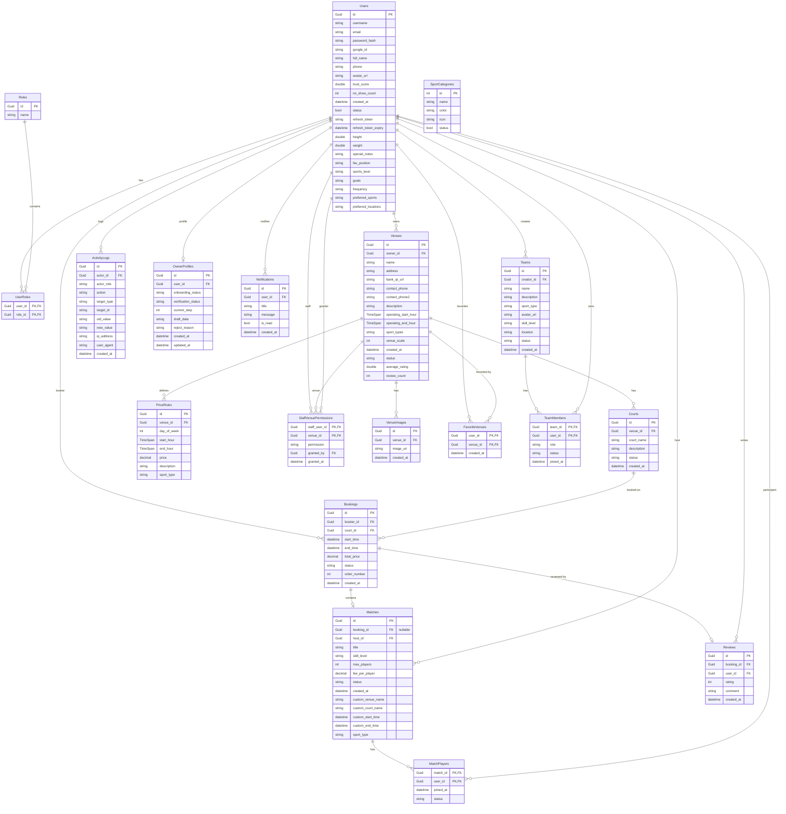

# Sơ đồ Entity Relationship Diagram (ERD) - SportConnect

Dưới đây là sơ đồ thực thể mối quan hệ (ERD) khớp chính xác với **19 bảng dữ liệu** được định nghĩa thông qua các thuộc tính `DbSet` trong lớp `MyDbContext` của ứng dụng backend.

## Danh sách 19 bảng khớp với mã nguồn DbContext:

1. **Users**: Lưu thông tin chi tiết người chơi/chủ sân.
2. **Roles**: Danh mục vai trò trong hệ thống (User, Owner, Admin...).
3. **UserRoles**: Bảng trung gian phân quyền người dùng.
4. **Venues**: Quản lý các cụm sân thể thao do đối tác sở hữu.
5. **Courts**: Chi tiết từng sân đấu đơn lẻ thuộc một cụm sân.
6. **PriceRules**: Thiết lập khung giá theo khung giờ/ngày trong tuần cho cụm sân.
7. **Bookings**: Thông tin giao dịch thuê sân của người chơi.
8. **Matches**: Thông tin kèo đấu ghép cặp/giao lưu thể thao.
9. **MatchPlayers**: Danh sách người chơi tham gia vào từng kèo đấu.
10. **StaffVenuePermissions**: Cấp quyền quản lý cụm sân cho nhân viên (Staff).
11. **ActivityLogs**: Ghi nhật ký hành động thay đổi dữ liệu của người dùng/admin để kiểm toán.
12. **VenueImages**: Bộ sưu tập hình ảnh liên kết với cụm sân.
13. **OwnerProfiles**: Thông tin đăng ký kinh doanh và trạng thái onboarding của chủ sân.
14. **SportCategories**: Danh mục các môn thể thao (Bóng đá, Cầu lông, Pickleball...).
15. **Notifications**: Quản lý thông báo đẩy gửi tới người dùng.
16. **FavoriteVenues**: Danh sách sân bóng yêu thích của người chơi.
17. **Reviews**: Đánh giá và chấm điểm chất lượng sân dựa trên lượt đặt sân đã xong.
18. **Teams**: Quản lý câu lạc bộ/đội nhóm thể thao.
19. **TeamMembers**: Quản lý danh sách thành viên tham gia câu lạc bộ.
