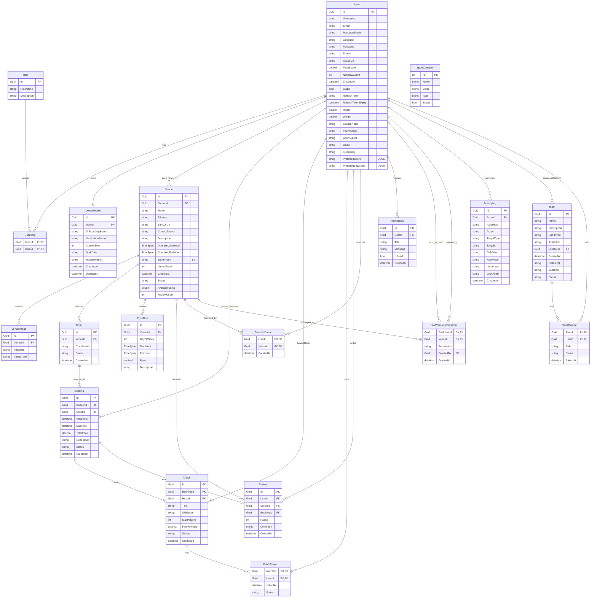

# Sơ đồ CSDL Hệ thống SportConnect

Tài liệu này mô tả chi tiết cấu trúc cơ sở dữ liệu quan hệ của hệ thống **SportConnect** được xây dựng trên ASP.NET Core 9 và SQL Server. Sơ đồ thực thể liên kết (Entity Relationship Diagram - ERD) được biểu diễn trực quan bên dưới, theo sau là đặc tả chi tiết của từng bảng.

---

## 1. Sơ đồ Quan hệ Thực thể (ERD)

---

## 2. Đặc tả Chi tiết các Bảng CSDL

### 2.1 Nhóm Người Dùng & Phân Quyền (User & Authentication)

#### Bảng `User`
Lưu trữ thông tin tài khoản người dùng của toàn hệ thống (bao gồm Khách hàng, Chủ sân, Nhân viên, và Admin).
* `Id` (Guid, PK): Định danh duy nhất.
* `Username` (string): Tên đăng nhập.
* `Email` (string): Email người dùng.
* `PasswordHash` (string, Nullable): Mật khẩu đã được mã hóa (null nếu đăng nhập qua Google).
* `GoogleId` (string, Nullable): ID tài khoản Google liên kết.
* `FullName` / `Phone` / `AvatarUrl` (string): Thông tin cá nhân cơ bản.
* `TrustScore` (double): Điểm tin cậy (mặc định 5.0, dùng cho việc kiểm tra hủy đặt sân / no-show).
* `NoShowCount` (int): Số lần đặt sân nhưng không đến.
* `Status` (bool): Trạng thái hoạt động (`true`: Hoạt động, `false`: Bị khóa).
* `RefreshToken` (string): Mã để lấy lại Access Token mới.
* `RefreshTokenExpiry` (DateTime): Thời gian hết hạn của Refresh Token.
* `Height` / `Weight` (double, Nullable): Chiều cao (cm) và Cân nặng (kg).
* `SpecialNotes` (string, Nullable): Ghi chú sức khỏe hoặc lưu ý đặc biệt.
* `FavPosition` (string, Nullable): Vị trí chơi yêu thích (ví dụ: Tiền đạo, Hậu vệ, Người đứng lưới...).
* `SportsLevel` (string, Nullable): Trình độ tự đánh giá (`BEGINNER`, `INTERMEDIATE`, `ADVANCED`).
* `Goals` / `Frequency` (string, Nullable): Mục tiêu tập luyện và Tần suất chơi thể thao.
* `PreferredSports` / `PreferredLocations` (string, Nullable): Danh sách môn thể thao và khu vực quận huyện ưa thích (định dạng JSON).

#### Bảng `Role` & `UserRole`
Phân chia vai trò trong hệ thống (như Admin, Owner, Customer, Staff).
* `UserRole` là bảng trung gian liên kết nhiều-nhiều giữa `User` và `Role`.

#### Bảng `OwnerProfile`
Chứa thông tin hồ sơ onboarding và phê duyệt của Chủ sân (Owner).
* `OnboardingStatus` (string): Trạng thái onboarding (`NotStarted`, `InProgress`, `Completed`).
* `VerificationStatus` (string): Trạng thái kiểm duyệt (`None`, `Pending`, `Verified`, `Rejected`).
* `DraftData` (string, JSON): Chứa dữ liệu bản nháp đăng ký kinh doanh/sân thể thao trước khi gửi duyệt.

---

### 2.2 Nhóm Sân Thể Thao (Venue & Court Management)

#### Bảng `Venue` (Cơ sở thể thao)
Quản lý các cụm sân thể thao (Ví dụ: Sân cầu lông ABC, Pickleball XYZ).
* `OwnerId` (Guid, FK -> `User`): Chủ sở hữu cụm sân.
* `OperatingStartHour` / `OperatingEndHour` (TimeSpan): Giờ mở/đóng cửa.
* `SportTypes` (List<string>): Các loại môn thể thao được hỗ trợ tại cụm sân.
* `Status` (string): Trạng thái cụm sân (`ACTIVE`, `INACTIVE`, `PENDING_APPROVAL`).
* `AverageRating` / `ReviewCount`: Thống kê điểm đánh giá từ khách hàng.

#### Bảng `Court` (Sân nhỏ lẻ)
Các sân chi tiết trong một cụm sân (Ví dụ: Sân số 1, Sân số 2, Sân VIP).
* `VenueId` (Guid, FK): Thuộc cụm sân nào.
* `SportType` (string): Loại môn thể thao áp dụng cho sân con (Ví dụ: `Pickleball`, `Cầu lông`, `Bóng đá`).
* `Status` (string): Trạng thái của sân lẻ (`AVAILABLE`, `MAINTENANCE`).

#### Bảng `PriceRule` (Khung giá sân)
Cấu hình giá linh hoạt theo thời gian và ngày trong tuần của từng cụm sân.
* `DayOfWeek` (int, Nullable): `0` là Chủ Nhật, `1-6` là Thứ 2 - Thứ 7. Nếu `null` thì áp dụng cho toàn bộ các ngày.
* `StartHour` / `EndHour` (TimeSpan): Khung giờ áp dụng (Ví dụ: 17:00:00 - 22:00:00).
* `Price` (decimal): Giá thuê sân/giờ trong khung giờ này.

#### Bảng `VenueImage` (Hình ảnh cụm sân)
* `ImageType` (string): Loại ảnh (`Avatar`, `Logo`, `Gallery`).

---

### 2.3 Nhóm Giao Dịch & Hoạt Động (Booking & Matchmaking)

#### Bảng `Booking` (Lượt đặt sân)
* `BookerId` (Guid, FK -> `User`): Người thực hiện đặt sân.
* `CourtId` (Guid, FK -> `Court`): Sân được đặt.
* `StartTime` / `EndTime` (DateTime): Thời gian bắt đầu và kết thúc thuê sân.
* `Status` (string): Trạng thái booking (`HOLDING`, `PENDING`, `CONFIRMED`, `CANCELLED`).
* `ReceiptUrl` (string, Nullable): Hóa đơn điện tử hoặc hóa đơn thanh toán từ VnPay.

#### Bảng `Match` (Kèo đấu / Ghép cặp)
Chủ sân hoặc người đặt sân có thể tạo kèo đấu từ một booking thành công để tìm người chơi cùng.
* `BookingId` (Guid, FK -> `Booking`): Gắn với khung giờ đặt sân.
* `HostId` (Guid, FK -> `User`): Người tạo kèo (Host).
* `SkillLevel` (string): Cấp độ yêu cầu (`BEGINNER`, `INTERMEDIATE`, `ADVANCED`).
* `FeePerPlayer` (decimal): Phí chia đều cho mỗi thành viên tham gia.
* `Status` (string): Trạng thái kèo (`OPEN`, `FULL`, `COMPLETED`, `CANCELLED`).

#### Bảng `MatchPlayer` (Người tham gia kèo)
Bảng liên kết nhiều-nhiều lưu trữ người đăng ký tham gia kèo đấu.
* `Status` (string): Trạng thái thành viên (`PENDING`, `APPROVED`, `REJECTED`, `NO_SHOW`).

---

### 2.4 Nhóm Tiện Ích & Log (Utilities & Logs)

#### Bảng `Review` (Đánh giá & Phản hồi)
Khách hàng viết đánh giá sau khi hoàn tất lượt đặt sân.
* Liên kết chặt chẽ với cả `User`, `Venue` và `Booking` để chống đánh giá ảo (chỉ những người đặt sân thật mới được đánh giá).

#### Bảng `FavoriteVenue` (Sân yêu thích)
Lưu giữ danh sách sân yêu thích của người chơi (`UserId` & `VenueId`).

#### Bảng `Notification` (Thông báo)
Hệ thống thông báo đẩy (Realtime thông qua SignalR và lưu trữ offline).

#### Bảng `StaffVenuePermission` (Phân quyền nhân viên)
* Cho phép Chủ sân gán quyền quản trị cụ thể cho tài khoản Nhân viên (`StaffUserId`) tại cụm sân (`VenueId`).
* `Permission` (string): Các mã quyền hành động định nghĩa trong `StaffPermissionCode` (Ví dụ: `CONFIRM_BOOKING`, `UPDATE_COURT_STATUS`,...).

#### Bảng `ActivityLog` (Nhật ký hệ thống)
* Lưu trữ lại các lịch sử tác động dữ liệu nhạy cảm (Tạo/Hủy đặt sân, Thay đổi trạng thái, Phê duyệt cụm sân).
* Hỗ trợ lưu trữ trạng thái trước và sau khi thay đổi thông qua định dạng JSON (`OldValue`, `NewValue`).

---

### 2.5 Nhóm Đội Nhóm & Cá Nhân Hóa (Teams & User Personalization)

#### Bảng `Team` (Thông tin Đội nhóm)
Quản lý các nhóm/câu lạc bộ thể thao do người dùng tự lập ra.
* `Id` (Guid, PK): Định danh duy nhất của đội nhóm.
* `Name` (string): Tên đội nhóm.
* `Description` (string, Nullable): Mô tả chi tiết về đội.
* `SportType` (string, Nullable): Môn thể thao chính của đội nhóm.
* `AvatarUrl` (string, Nullable): Ảnh đại diện của đội.
* `CreatorId` (Guid, FK -> `User`): Người sáng lập / Đội trưởng ban đầu.
* `CreatedAt` (DateTime): Ngày giờ thành lập đội nhóm.
* `SkillLevel` (string, Nullable): Trình độ chuyên môn (`BEGINNER`, `INTERMEDIATE`, `ADVANCED`).
* `Location` (string, Nullable): Khu vực hoạt động chính.
* `Status` (string): Trạng thái hoạt động (`ACTIVE`, `INACTIVE`).

#### Bảng `TeamMember` (Thành viên Đội nhóm)
Bảng trung gian quản lý danh sách thành viên thuộc các đội nhóm.
* `TeamId` (Guid, PK, FK -> `Team`): Đội nhóm liên kết.
* `UserId` (Guid, PK, FK -> `User`): Thành viên liên kết.
* `Role` (string): Vai trò của thành viên trong đội (`CAPTAIN`, `MEMBER`).
* `Status` (string): Trạng thái thành viên (`PENDING`, `APPROVED`, `REJECTED`).
* `JoinedAt` (DateTime): Thời gian gia nhập đội nhóm.
