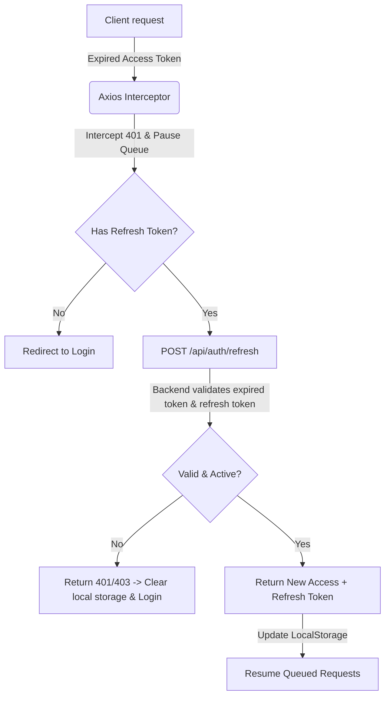

# Hướng Dẫn Kiến Trúc & Tài Liệu Refactor (Dành Cho Fresher)

Tài liệu này mô tả chi tiết các thay đổi trong đợt tái cấu trúc (refactoring) mã nguồn hệ thống SportConnect để sẵn sàng chạy môi trường production. Mục tiêu là giúp các kỹ sư mới (fresher) nắm bắt nhanh cấu trúc tệp tin, mục đích thiết kế, các lớp, hàm và các luồng nghiệp vụ cốt lõi vừa được tối ưu hóa.

---

## Tổng Quan Luồng Refactor

Hệ thống được cải tiến ở 3 khía cạnh kỹ thuật chính:
1. **Silent Refresh (Làm mới token tự động):** Ngăn chặn việc đẩy người dùng về trang đăng nhập đột ngột khi Access Token hết hạn bằng cách dùng cặp Refresh Token lưu trong Database.
2. **Transaction Database (Giao dịch nguyên tố):** Đảm bảo luồng đăng ký đối tác (Owner Onboarding) lưu đồng thời cả hồ sơ cá nhân và sân thể thao một cách toàn vẹn hoặc hoàn tác toàn bộ nếu xảy ra lỗi.
3. **Centralized Exception Handling (Xử lý lỗi tập trung):** Loại bỏ `try-catch` cục bộ ở Controller để ngoại lệ tự động nổi lên và được Middleware định dạng phản hồi chuẩn hóa.



---

## Chi Tiết Các Tệp Tin & Hàm (Tầng Backend)

### 1. SportConnect.Core (Thực thể & Ngoại lệ)

#### [User.cs](file:///d:/IT/HK2_Y4/DATN/Backend/SportConnect.Core/Entities/User.cs)
*   **Mục đích:** Mở rộng thực thể cơ sở dữ liệu của người dùng để hỗ trợ cơ chế lưu vết Refresh Token.
*   **Các thuộc tính bổ sung:**
    *   `RefreshToken` (`string?`): Chuỗi token ngẫu nhiên mã hóa Base64 lưu trữ token làm mới.
    *   `RefreshTokenExpiry` (`DateTime?`): Thời điểm hết hạn của Refresh Token (sử dụng chuẩn UTC).

---

### 2. SportConnect.Infrastructure (Lưu trữ & Truy xuất)

#### [MyDbContext.cs](file:///d:/IT/HK2_Y4/DATN/Backend/SportConnect.Infrastructure/Persistence/Context/MyDbContext.cs)
*   **Mục đích:** Cấu hình ánh xạ thuộc tính trong C# Entity sang các cột dữ liệu tương ứng trong bảng của SQL Server.
*   **Thay đổi chi tiết:** Mapped trường `RefreshToken` thành cột `refresh_token` (giới hạn 500 ký tự) và `RefreshTokenExpiry` thành cột `refresh_token_expiry` trong bảng `Users`.

#### [UnitOfWork.cs](file:///d:/IT/HK2_Y4/DATN/Backend/SportConnect.Infrastructure/Persistence/Repositories/UnitOfWork.cs)
*   **Mục đích:** Triển khai mẫu thiết kế Unit of Work nhằm quản lý vòng đời và các kết nối cơ sở dữ liệu tập trung.
*   **Các hàm mới:**
    *   `BeginTransactionAsync()`: Bắt đầu một Transaction cơ sở dữ liệu ngầm và gán vào biến local `_transaction`.
    *   `CommitTransactionAsync()`: Xác nhận và lưu trữ vĩnh viễn các thay đổi đã thực hiện trong Transaction. Tự động giải phóng bộ nhớ của đối tượng transaction.
    *   `RollbackTransactionAsync()`: Hủy bỏ toàn bộ các thay đổi được thực hiện trong Transaction hiện tại nếu xảy ra lỗi.
    *   `Dispose()`: Cập nhật cơ chế dọn dẹp để tự động dispose transaction nếu còn tồn tại trước khi đóng kết nối DbContext.

---

### 3. SportConnect.Application (Logic Nghiệp Vụ & DTOs)

#### [AuthResultDto.cs](file:///d:/IT/HK2_Y4/DATN/Backend/SportConnect.Application/DTOs/Auth/AuthResultDto.cs)
*   **Mục đích:** DTO (Data Transfer Object) trả về cho Client chứa đầy đủ thông tin xác thực mới.
*   **Thuộc tính:**
    *   `Token` (`string`): Access Token JWT mới để client đính kèm vào header request.
    *   `RefreshToken` (`string`): Refresh Token mới để client lưu trữ cho lượt refresh tiếp theo.

#### [RefreshTokenDto.cs](file:///d:/IT/HK2_Y4/DATN/Backend/SportConnect.Application/DTOs/Auth/RefreshTokenDto.cs)
*   **Mục đích:** DTO nhận yêu cầu làm mới token gửi lên từ Client.
*   **Thuộc tính:**
    *   `AccessToken` (`string`): Access Token đã hết hạn.
    *   `RefreshToken` (`string`): Refresh Token đang được lưu trữ tại thiết bị client.

#### [IAuthService.cs](file:///d:/IT/HK2_Y4/DATN/Backend/SportConnect.Application/Interfaces/IAuthService.cs)
*   **Mục đích:** Định nghĩa hợp đồng nghiệp vụ xác thực tài khoản.
*   **Các hàm cập nhật:**
    *   `LoginAsync(LoginDto loginDto)`: Thay đổi kiểu trả về thành `Task<AuthResultDto>`.
    *   `AdminLoginAsync(LoginDto loginDto)`: Thay đổi kiểu trả về thành `Task<AuthResultDto>`.
    *   `RegisterAsync(RegisterDto registerDto)`: Thay đổi kiểu trả về thành `Task<AuthResultDto>`.
    *   `GoogleLoginAsync(GoogleLoginDto googleLoginDto)`: Thay đổi kiểu trả về thành `Task<AuthResultDto>`.
    *   `RefreshAsync(RefreshTokenDto dto)`: Khai báo phương thức thực hiện làm mới token.

#### [AuthService.cs](file:///d:/IT/HK2_Y4/DATN/Backend/SportConnect.Application/Services/AuthService.cs)
*   **Mục đích:** Xử lý nghiệp vụ xác thực chính của hệ thống.
*   **Các hàm cập nhật & thêm mới:**
    *   `LoginAsync`, `AdminLoginAsync`, `RegisterAsync`, `GoogleLoginAsync`: Sau khi tạo thành công Access Token, gọi thêm hàm `GenerateRefreshToken()` và cập nhật thông tin Refresh Token mới cùng thời gian hết hạn (`RefreshTokenExpiry`) vào thực thể User trong DB. Trả về đối tượng `AuthResultDto`.
    *   `RefreshAsync(RefreshTokenDto dto)`:
        *   **Tham số:** `RefreshTokenDto` chứa cặp token cũ.
        *   **Luồng xử lý:** Giải mã Access Token đã hết hạn để lấy `UserId` -> Kiểm tra Refresh Token gửi lên có khớp trong DB và còn hạn sử dụng hay không -> Tạo mới cặp Access Token + Refresh Token -> Cập nhật DB -> Trả về `AuthResultDto`.
    *   `GenerateRefreshToken()`: Hàm private dùng bộ sinh số ngẫu nhiên cấp độ bảo mật cao (`RandomNumberGenerator`) để tạo chuỗi mã hóa 32 bytes dưới dạng Base64.
    *   `GetPrincipalFromExpiredToken(string token)`: Hàm private nhận token đã hết hạn, vô hiệu hóa việc kiểm tra thời gian hết hạn của token (`ValidateLifetime = false`) để đọc thông tin định danh (ClaimsPrincipal).

#### [OwnerOnboardingService.cs](file:///d:/IT/HK2_Y4/DATN/Backend/SportConnect.Application/Services/OwnerOnboardingService.cs)
*   **Mục đích:** Quản lý quy trình đăng ký làm chủ sân (Owner Onboarding).
*   **Hàm cập nhật:**
    *   `SubmitAsync(Guid userId, string draftData)`:
        *   **Mô tả:** Đã được bao bọc trong một Transaction (`BeginTransactionAsync`).
        *   **Luồng:** Lưu trạng thái hồ sơ chủ sân -> Đọc và phân tích thông tin sân thể thao từ chuỗi `draftData` -> Tạo và thêm mới thực thể `Venue` -> Gọi `CompleteAsync` để lưu toàn bộ thay đổi -> Commit Transaction.
        *   **Xử lý lỗi:** Nếu việc phân tích cú pháp JSON lỗi hoặc lưu trữ thất bại, hàm sẽ nhảy vào khối `catch`, kích hoạt `RollbackTransactionAsync()` để xóa bỏ tất cả các bản ghi trung gian nhằm tránh dữ liệu rác, sau đó ném ra một `AppException`.

---

### 4. SportConnect.API (Các Cổng API Tiếp Nhận)

#### [AuthController.cs](file:///d:/IT/HK2_Y4/DATN/Backend/SportConnect.API/Controllers/AuthController.cs)
*   **Mục đích:** Expose các cổng HTTP REST API phục vụ cho Client đăng nhập/đăng ký.
*   **Hàm cập nhật & thêm mới:**
    *   `Login`, `AdminLogin`, `Register`, `GoogleLogin`: Trả về cả Access Token (`Token`) và `RefreshToken` trong Response Body dưới dạng JSON camelCase.
    *   `Refresh([FromBody] RefreshTokenDto dto)`: Cổng API mới nhận phương thức `POST api/auth/refresh` không yêu cầu xác thực đăng nhập trước (`[AllowAnonymous]`), truyền trực tiếp dữ liệu xuống `_authService.RefreshAsync`.

#### [ReviewController.cs](file:///d:/IT/HK2_Y4/DATN/Backend/SportConnect.API/Controllers/ReviewController.cs)
*   **Mục đích:** Quản lý các đánh giá sân bãi từ khách hàng.
*   **Hàm cập nhật:**
    *   `CreateReview([FromBody] CreateReviewDto dto)`: Loại bỏ khối `try-catch` cục bộ trả về `BadRequest`. Hàm giờ chỉ gọi trực tiếp tới tầng Service và trả về kết quả thành công. Mọi lỗi nghiệp vụ hoặc hệ thống phát sinh sẽ tự động nổi lên và được xử lý tại `GlobalExceptionMiddleware`.

---

## Chi Tiết Các Tệp Tin & Hàm (Tầng Frontend)

### 1. Frontend User (Khách hàng & Chủ sân)

#### [axiosClient.ts](file:///d:/IT/HK2_Y4/DATN/Frontend/user/src/api/axiosClient.ts)
*   **Mục đích:** Thiết lập cấu hình HTTP Client sử dụng Axios cho toàn bộ ứng dụng người dùng.
*   **Cơ chế hoạt động:**
    *   *Request Interceptor:* Lấy `token` từ LocalStorage đính kèm vào header `Authorization: Bearer <token>` cho mỗi request gửi đi.
    *   *Response Interceptor:*
        1. Nếu phản hồi thành công, trả về trực tiếp `response.data`.
        2. Nếu phản hồi thất bại với lỗi `401/403` và không phải là các request tới API đăng nhập/làm mới token:
            * Đánh dấu request ban đầu bằng cờ `_retry = true`.
            * Nếu chưa có tiến trình làm mới token nào chạy (`isRefreshing = false`), đặt cờ thành `true` và thực hiện gửi request ngầm `POST /api/auth/refresh` bằng cặp token hiện tại.
            * Nếu thành công: Lưu cặp token mới vào LocalStorage, phát tín hiệu cho các request đang đợi (`onRefreshed`), rồi thực thi lại request ban đầu.
            * Nếu thất bại (Refresh Token hết hạn hẳn): Xóa toàn bộ token khỏi bộ nhớ và chuyển hướng người dùng về trang `/login`.

#### [LoginForm.tsx](file:///d:/IT/HK2_Y4/DATN/Frontend/user/src/components/auth/LoginForm.tsx) / [RegisterForm.tsx](file:///d:/IT/HK2_Y4/DATN/Frontend/user/src/components/auth/RegisterForm.tsx) / [LoginPage.tsx](file:///d:/IT/HK2_Y4/DATN/Frontend/user/src/pages/auth/LoginPage.tsx)
*   **Thay đổi nghiệp vụ:** Sau khi nhận kết quả từ API Đăng nhập/Đăng ký/Google Login thành công, thực hiện lưu trữ cả hai giá trị `token` và `refreshToken` vào LocalStorage thông qua:
    ```typescript
    localStorage.setItem('token', data.token);
    localStorage.setItem('refreshToken', data.refreshToken);
    ```

---

### 2. Frontend Admin (Quản trị hệ thống)

#### [api-client.ts](file:///d:/IT/HK2_Y4/DATN/Frontend/admin/src/lib/api-client.ts)
*   **Mục đích:** Thiết lập cấu hình HTTP Client cho trang quản trị Next.js.
*   **Cơ chế hoạt động:** Tương tự `axiosClient.ts` ở phía người dùng, nhưng sử dụng bộ khóa lưu trữ khác trong LocalStorage là `adminToken` và `adminRefreshToken` để tránh xung đột tài khoản khi mở đồng thời cả hai trang trên cùng một trình duyệt, đồng thời trỏ hướng chuyển khoản thất bại về trang `/auth/v1/login`.

#### [login-form.tsx](file:///d:/IT/HK2_Y4/DATN/Frontend/admin/src/app/\(main\)/auth/_components/login-form.tsx)
*   **Thay đổi nghiệp vụ:** Lưu trữ cả `adminToken` và `adminRefreshToken` vào LocalStorage sau khi Admin đăng nhập thành công.

---

## Những Điều Lưu Ý Cho Fresher

> [!IMPORTANT]
> **1. Quy tắc sử dụng Transactions:**
> Chỉ sử dụng Transactions (`BeginTransactionAsync`) khi một phương thức nghiệp vụ ghi dữ liệu vào từ 2 bảng khác nhau trở lên mà có quan hệ phụ thuộc chặt chẽ (ví dụ: Tạo hóa đơn + trừ kho, Đăng ký hồ sơ + tạo sân). Luôn gọi `CommitTransactionAsync()` ở cuối khối `try` và `RollbackTransactionAsync()` ở đầu khối `catch`.

> [!WARNING]
> **2. Xử lý Token trên Frontend:**
> Tuyệt đối không dùng Axios Client thông thường để gọi API Refresh Token vì điều này dễ gây ra vòng lặp vô tận (infinite loop 401). Phải dùng thực thể `axios` thuần (không cấu hình sẵn interceptor) để thực hiện cuộc gọi refresh token ngầm.

> [!NOTE]
> **3. Không tự ý viết Try-Catch ở Controller:**
> Trong hệ thống này, tầng Controller chỉ làm nhiệm vụ nhận dữ liệu đầu vào và trả về HTTP Response. Logic xử lý lỗi thuộc về `GlobalExceptionMiddleware`. Hãy để ngoại lệ tự bay lên từ tầng Application.
